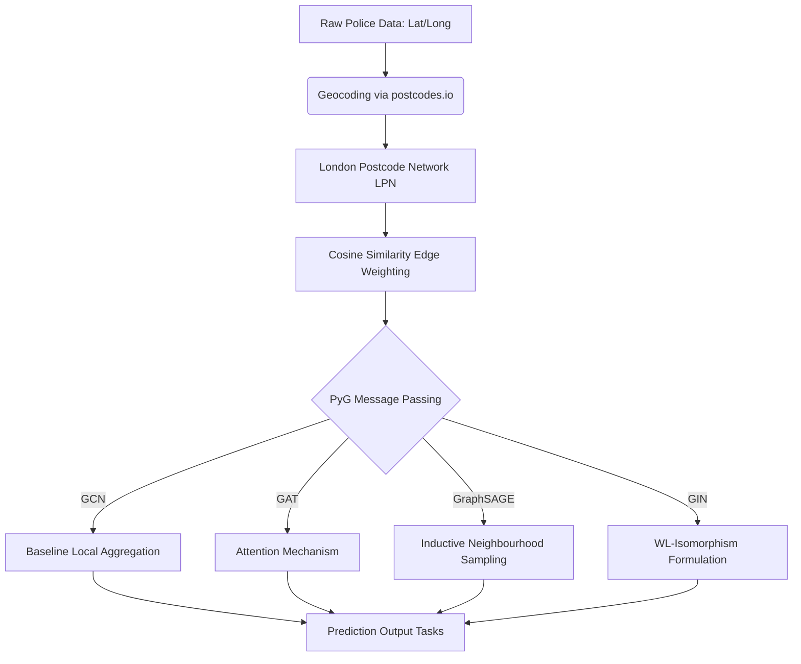

# London Crime Prediction with Graph Neural Networks

Predicting postcode-level crime hotspots in London by modelling urban geography as a weighted socioeconomic graph, benchmarking four GNN architectures against spatial homogeneity.

[](https://www.python.org/downloads/)
[](https://pyg.org/)
[](https://opensource.org/licenses/MIT)

## Key Results

- **GraphSAGE outperformed baselines:** GraphSAGE outperformed baselines: achieved **56.2%** lower MSE than the GCN baseline when forecasting the full 14-class crime matrix for held-out postcodes (full experiment set). Supporting split results: **54.1%** lower MSE on one-crime-per-month and **30.2%** lower MSE on specific-node predictions.
- **Topological isolation:** The River Thames acts as a natural crime boundary. Cosine similarity between adjacent E14 and E1 postcodes peaked at **0.89**, dropping to **0.41** for adjacent postcodes across the river (SE8).
- **Attention mechanism redundancy:** GAT models showed no meaningful improvement over GCNs. This confirmed that crime data is sufficiently spatially homogeneous once baseline edges are weighted via cosine similarity.

## Problem & Motivation

Predicting granular, postcode-level crime is historically constrained by arbitrary geographical boundaries and noisy reporting. Traditional statistical methods and CNNs applied to rigid map grids fail to capture the complex, non-Euclidean connectivity of actual urban environments.

This project treats London as a relational graph. Nodes are postcodes. Edges are spatial adjacencies weighted by socioeconomic similarity. I built this as my MSci Computer Science dissertation at the University of Exeter. To my knowledge, it represents the first application of GNNs targeting London crime rates at strict postcode resolution.

## Architecture

The system relies on the London Postcode Network (LPN), a graph mathematically constructed from scratch using NetworkX.

Nodes represent 119 geographical postcodes. The node feature space consists of tensors shaped `[num_nodes, 168]` containing 14 crime types tracked over 12 months. Edges denote geographical adjacency. Crucially, edge weights are derived via cosine similarity between connected node feature vectors, ensuring high-volume generic crimes do not mask low-volume severe offences. Four message-passing paradigms were evaluated: GCN, GAT, GraphSAGE, and GIN.



## Quick Start

```python
import torch
from utils.data_loader import load_data
from utils.graph_utils import create_graph, gen_edge_weights, data_prep
from models.sage import GraphSAGE

# Prepare the data
data_matrix, postcode_to_index, data_dict = load_data('./data/csv/crime_count_2.csv')
G = create_graph(postcode_to_index)
G = gen_edge_weights(G, data_matrix)
lpn_data = data_prep(G, data_dict)

model = GraphSAGE(in_channels=168, hidden_channels=256, out_channels=14)
# model.load_state_dict(torch.load('checkpoints/graphsage_best.pt'))
predictions = model(lpn_data.x, lpn_data.edge_index, lpn_data.edge_attr)
print(f"Predicted crime matrix shape: {predictions.shape}")
```

## Installation

```bash
git clone https://github.com/theodpozzo/london-crime-gnn.git
cd london-crime-gnn
conda create -n crime-gnn python=3.10
conda activate crime-gnn
pip install -r requirements.txt
```

## Results & Discussion

GraphSAGE empirically dominated all tasks, leveraging inductive neighbourhood sampling to generalise efficiently. The core challenge was spatial homogeneity. Crime is heavily autocorrelated across short distances, meaning naive models can achieve low MSE simply by outputting local averages.

Weight decay proved to have minimal impact across the sweeping parameters. Extending training beyond 500 epochs showed severe diminishing returns. I deliberately avoided normalising the target output vectors to preserve absolute crime spikes in the loss function, which made converging the GIN architecture particularly unstable.

## Project Structure

```text
.
├── data/               # Raw CSV, SQLite DB, and SQL scripts
├── models/             # PyTorch implementations of GCN, GAT, GraphSAGE, GIN
├── results/            # Outputs from model training and evaluation
├── utils/              # Helper modules (data loading, graph logic, training loops)
├── main.py             # Entry point for training loops
├── read_clean_results.py # Parses and cleans experimental results
├── read_results.py     # Parses experimental results
├── The Predictability of Crime in London Slides.pdf
├── The Predictability of Crime in London using Graph Neural Networks Final Report.pdf
└── README.md
```

## Technical Details

- **Hyperparameters:** Learning Rate [0.0001 - 0.05], Hidden Channels [32 - 512], Epochs [50 - 1000].
- **Hardware:** Developed and trained locally on an Intel i5-4690K and a single Nvidia GTX 960.
- **Feature Engineering:** SKLearn StandardScaler applied strictly prior to cosine similarity computation to balance high-variance crime vectors.

## Future Work

- **Transit Integration:** Integrating the TfL London Underground network as a parallel edge-index layer to map transit-facilitated crime spillovers.
- **Temporal Anomalies:** Injecting multi-year data grids spanning the COVID-19 pandemic to evaluate inductive robustness against extreme societal shifts.
- **Socioeconomic Feature Fusion:** Expanding the 168-dim feature vector with granular census data including income percentiles and housing density.

## Author

Built by [Theo Dal Pozzo](https://www.linkedin.com/in/theo-dal-pozzo/) · MSci Computer Science, University of Exeter · [Featured on BBC News](https://www.bbc.co.uk/news/articles/cm2rmjnlm94o) discussing AI's impact on the graduate job market.